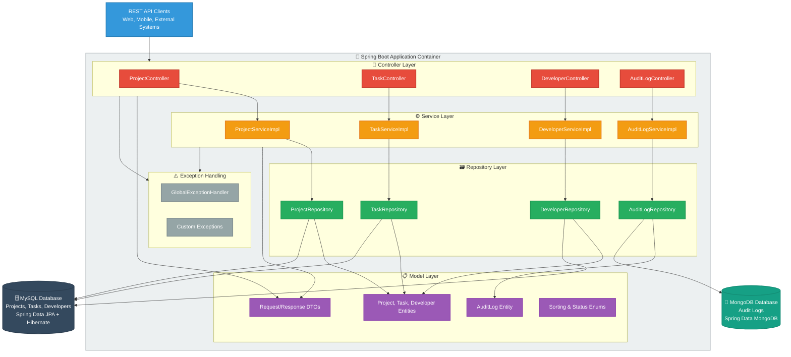
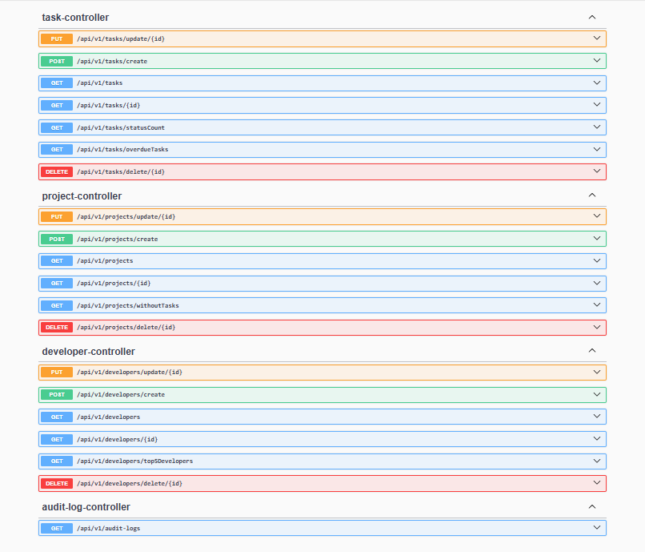

# **Project Tracker** 🚀
*A comprehensive RESTful API service for tracking projects, developers, and tasks with comprehensive audit logging*


---

## **📋 Table of Contents**
- [Architecture Overview](#-architecture-overview)
- [Tech Stack](#-tech-stack)
- [Features](#-features)
- [API Endpoints](#-api-endpoints)
- [Getting Started](#-getting-started)
- [Configuration](#-configuration)
- [API Documentation](#-api-documentation)


---

## **🏗 Architecture Overview**

This application follows a layered architecture pattern with dual-database strategy for optimal performance and data separation.

### **System Architecture**


---

## **🛠 Tech Stack**

| Component                   | Technology                    | Purpose                           |
|-----------------------------|-------------------------------|-----------------------------------|
| **Runtime**                 | Java JDK 24 (Alpine)          | Application runtime environment   |
| **Framework**               | Spring Boot 3.4.5             | Core application framework        |
| **ORM**                     | Spring Data JPA + Hibernate   | Relational database operations    |
| **NoSQL Integration**       | Spring Data MongoDB           | Document database operations      |
| **Relational Database**     | MySQL 8.0.33                 | Primary data persistence          |
| **Document Database**       | MongoDB 7.0                   | Audit logs and analytics          |
| **Caching**                 | Spring Boot In-Memory Cache   | Performance optimization          |
| **API Documentation**       | Swagger/OpenAPI 3             | Interactive API documentation     |
| **Containerization**        | Docker + Docker Compose       | Deployment and orchestration      |
| **Build Tool**              | Maven                         | Dependency management & building  |

---

## **✨ Features**

### **Core Functionality**
- 🏗 **Project Management**: Create, update, delete, and track projects with status monitoring
- 👥 **Developer Management**: Manage developers and task assignments
- 📋 **Task Management**: Create and track tasks with due dates
- 📊 **Audit Logging**: Comprehensive activity tracking stored in MongoDB
- 🔍 **Advanced Filtering**: Sort and filter data across multiple criteria
- ⚡ **Performance Optimized**: In-memory caching for frequently accessed data

### **Data Management**
- **Polyglot Persistence**: MySQL for transactional data, MongoDB for audit logs
- **Exception Handling**: Global error handling with custom exceptions
- **Data Validation**: Request/Response DTOs with validation
- **Sorting & Filtering**: Flexible data retrieval options

---

## **🔌 API Endpoints**

### **📁 Project Endpoints**
| Method   | Endpoint                        | Description                    | Parameters       |
|----------|---------------------------------|--------------------------------|------------------|
| `POST`   | `/api/v1/projects/create`       | Create new project             | Request body     |
| `PUT`    | `/api/v1/projects/update/{id}`  | Update existing project        | `id` (path)      |
| `DELETE` | `/api/v1/projects/delete/{id}`  | Delete project                 | `id` (path)      |
| `GET`    | `/api/v1/projects`              | Get all projects               | `sortBy` (query) |
| `GET`    | `/api/v1/projects/withoutTasks` | Get all projects without tasks | `sortBy` (query) |
| `GET`    | `/api/v1/projects/{id}`         | Get project by ID              | `id` (path)      |

**Sorting Options:**
- `SORT_BY_ID` (Default)
- `SORT_BY_NAME`
- `SORT_BY_DEADLINE`
- `SORT_BY_STATUS`

### **👨‍💻 Developer Endpoints**
| Method   | Endpoint                            | Description                         | Parameters       |
|----------|-------------------------------------|-------------------------------------|------------------|
| `POST`   | `/api/v1/developers/create`         | Create new users                | Request body     |
| `PUT`    | `/api/v1/developers/update/{id}`    | Update existing users           | `id` (path)      |
| `DELETE` | `/api/v1/developers/delete/{id}`    | Delete users                    | `id` (path)      |
| `GET`    | `/api/v1/developers`                | Get all developers                  | `sortBy` (query) |
| `GET`    | `/api/v1/developers/{id}`           | Get users by ID                 | `id` (path)      |
| `GET`    | `/api/v1/developers/top5Developers` | Get top 5 users with most tasks | `none`           |

**Sorting Options:**
- `SORT_BY_ID` (Default)
- `SORT_BY_NAME`

### **📋 Task Endpoints**
| Method   | Endpoint                     | Description              | Parameters       |
|----------|------------------------------|--------------------------|------------------|
| `POST`   | `/api/v1/tasks/create`       | Create new task          | Request body     |
| `PUT`    | `/api/v1/tasks/update/{id}`  | Update existing task     | `id` (path)      |
| `DELETE` | `/api/v1/tasks/delete/{id}`  | Delete task              | `id` (path)      |
| `GET`    | `/api/v1/tasks`              | Get all tasks            | `sortBy` (query) |
| `GET`    | `/api/v1/tasks/overdueTasks` | Get overdue tasks        | `sortBy` (query) |
| `GET`    | `/api/v1/tasks/{id}`         | Get task by ID           | `id` (path)      |
| `GET`    | `/api/v1/tasks/statusCount`  | Get task count by status | `none`           |

**Sorting Options:**
- `SORT_BY_TITLE` (Default)
- `SORT_BY_DUE_DATE`
- `SORT_BY_STATUS`

### **📊 Audit Log Endpoints**
| Method | Endpoint | Description | Parameters |
|--------|----------|-------------|------------|
| `GET` | `/api/v1/audit-logs` | Get audit logs | `sortBy` (query) |

**Sorting Options:**
- `SORT_BY_TIMESTAMP` (Default)
- `SORT_BY_ID`
- `SORT_BY_ACTION_TYPE`
- `SORT_BY_ENTITY_TYPE`
- `SORT_BY_ACTOR_NAME`
---

## **🚀 Getting Started**

### **Prerequisites**
- Docker and Docker Compose installed
- Java 24 (if running locally)
- Maven 3.9.9 (if building locally)

### **Quick Start with Docker**

1. **Clone the repository**
   ```bash
   git clone https://github.com/XzibiT-Collins/Project-Tracker.git
   cd project-tracker
   ```

2. **Build and run containers**
   ```bash
   docker compose up --build
   ```

3. **Access the application**
    - API Base URL: `http://localhost:8080`
    - Swagger UI: `http://localhost:8080/swagger-ui/index.html`

### **Individual Docker Commands**

```bash
# Build Docker image
docker compose build

# Start containers
docker compose up

# Stop containers
docker compose down
```

---

## **⚙️ Configuration**

### **Environment Variables**

| Variable | Description | Default Value |
|----------|-------------|---------------|
| `MYSQL_DATABASE_NAME` | MySQL database name | `project_db`  |
| `MYSQL_USERNAME` | MySQL username | `root`        |
| `MYSQL_ROOT_PASSWORD` | MySQL root password | `password`    |
| `MONGO_DATABASE_NAME` | MongoDB database name | `audit_db`    |
| `MONGO_DB_USERNAME` | MongoDB username | `root`        |
| `MONGO_DB_PASSWORD` | MongoDB password | `password`    |


### **Example .env File**
```markdown
#example.env

MYSQL_DATABASE_NAME= #name of database
MYSQL_ROOT_PASSWORD= #database password
MYSQL_USERNAME= #database username

MONGO_DB_USERNAME= #database username
MONGO_DB_PASSWORD= #database password
MONGO_DATABASE_NAME= #name of database
```


### **Database Configuration**

The application uses a dual-database approach:
- **MySQL**: Stores core business entities (Projects, Tasks, Developers)
- **MongoDB**: Stores audit logs

---

## **📚 API Documentation**

### **Interactive Documentation**
Access the Swagger UI for interactive API testing:
```
http://localhost:8080/swagger-ui/index.html
```

### **API Specification**
OpenAPI 3.0 specification available at:
```
http://localhost:8080/v3/api-docs
```



---

## **🔧 Development**

### **Local Development Setup**

1. **Install dependencies**
   ```bash
   mvn clean install
   ```

2. **Build target file**
   ```bash
   mvn clean package
   ```
3. **Run .jar file**
    ```bash
   cd target
   java -jar tracker-0.0.1-SNAPSHOT.jar
   ```


### **Project Structure**
```
src/
├── main/
│   ├── java/com/project/tracker/
│   │   ├── controllers/               # Controllers
│   │   ├── dto/                       # Response and Request DTO's
│   │   │   ├── requestDto/
│   │   │   └── responseDto/
│   │   ├── exceptions/
│   │   │   ├── customExceptions/      # Custom exceptions
│   │   │   └── globalExceptions/      # global exception handling
│   │   ├── models/                    # Models
│   │   ├── repositories/              # Repositories
│   │   ├── services/                  # Service Layer interfaces and Impl
│   │   │   └── serviceInterfaces/
│   │   └── sortingEnums/              # Enums for sorting and status
│   │   └── TrackerApplication.java
│   └── resources/
│       └── application.yml            # Configuration
└── test/                              # Unit and Integration Tests
```
---