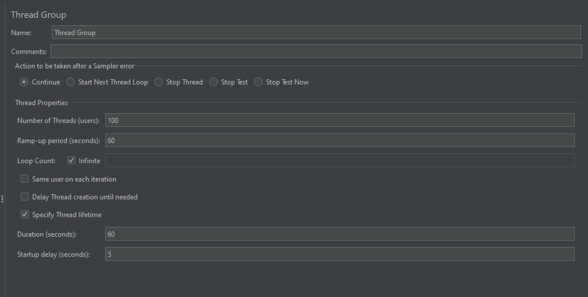
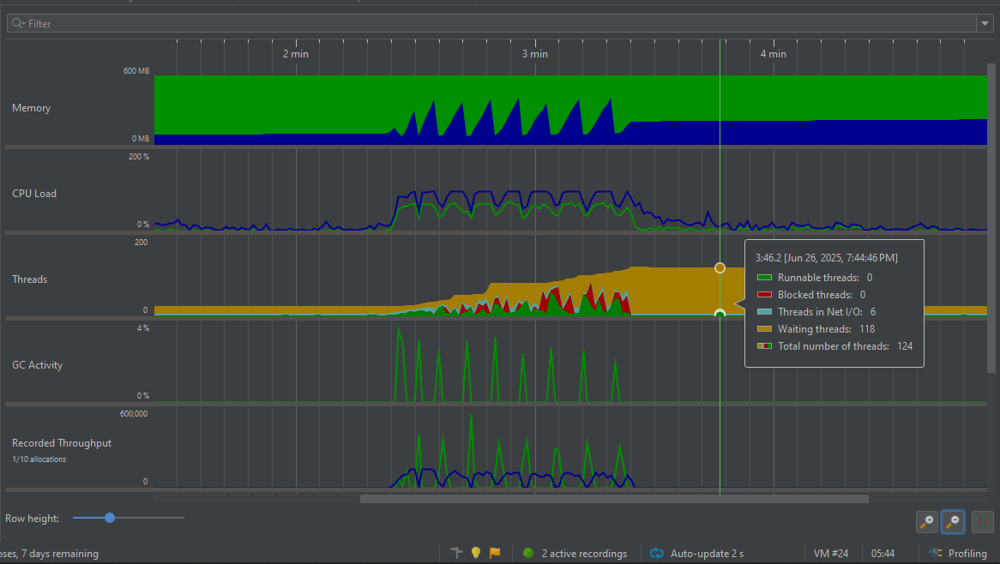
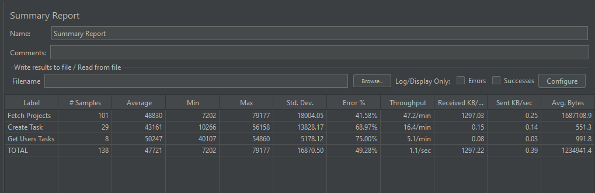
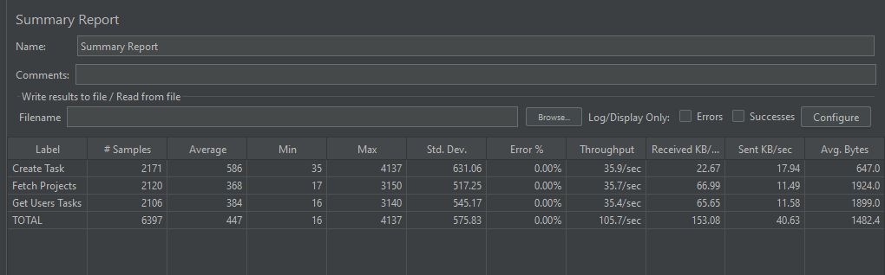
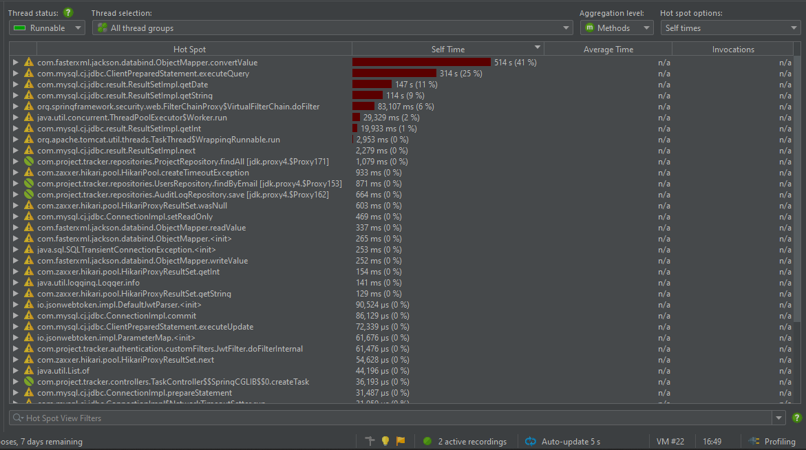
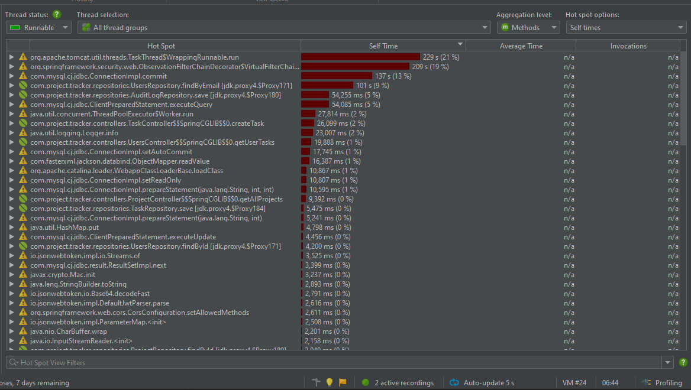
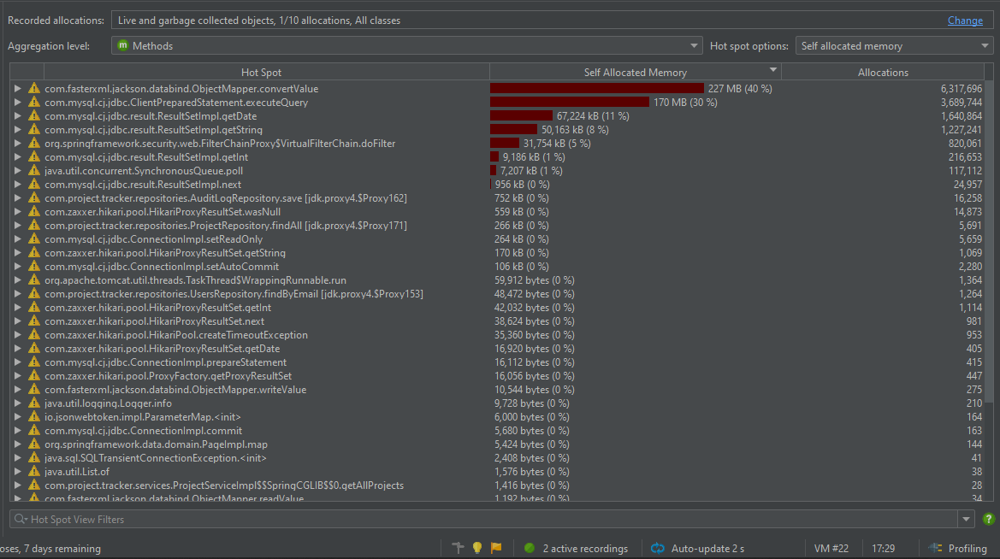
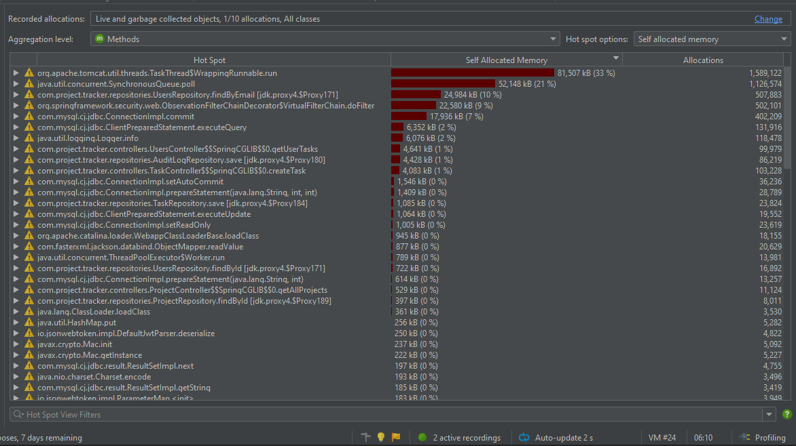

# 🚀 **Tracker Boost**
*Performance Optimization Report with JMeter & JProfiler*

---

## 📚 Table of Contents
- [Test Scenario](#-test-scenario)
- [Before & After Optimization](#-before--after-optimization)
- [JMeter Benchmark Results](#-jmeter-report)
- [CPU Hotspot Analysis](#-cpu-hotspot)
- [Memory Hotspot Analysis](#-memory-hotspot)
- [Key Optimization Strategies](#-key-optimization-strategies)
- [Performance Summary](#-performance-summary)

---

## 🧪 Test Scenario
Load testing with JMeter to analyze system behavior **before and after** applying optimizations (DTOs, caching, manual mapping, entity tuning, and response refactoring).



---

## ⚙️ Before & After Optimization

### 🔴 **Before Optimization**


### ✅ **After Optimization**


```text
🧠 Memory Usage
- Before: Sharp spikes, peaking at ~600MB. GC couldn't reclaim memory effectively — potential memory leak.
- After: Stable memory profile with consistent usage. GC successfully freed memory post-load.

⚙️ CPU Load
- Before: Consistent 100%+ CPU usage throughout — high sustained load.
- After: Lower and more dynamic CPU load. Spikes reduced due to optimized operations like caching.

♻️ Garbage Collection
- Before: High GC pressure with frequent green spike activity.
- After: GC activity greatly reduced. Fewer and less intense cycles observed.
```

---

## 📊 JMeter Report

### 📉 **Before Optimization**


### 📈 **After Optimization**


### 📊 **Performance Metrics Comparison**

| **Metric**               | **Before**      | **After**       | **Improvement**        |
|--------------------------|------------------|------------------|-------------------------|
| Total Samples Processed  | 1,386            | 6,397            | +4,537%                 |
| Average Response Time    | 47,721 ms        | 447 ms           | 🚀 106× faster          |
| System Throughput        | 1.1/sec          | 105.7/sec        | ⚡ 96× increase          |
| Error Rate               | 49.28%           | 0.00%            | ✅ Perfect reliability   |

---

## 🔥 CPU Hotspot

### 🔴 **Before Optimization**


### ✅ **After Optimization**


```text
🔄 Object Mapping
- Before: `ObjectMapper.convertValue` consumed 41% of total CPU. Major bottleneck due to per-request mapping.
- After: Replaced with manual mappers — significantly more efficient.

📊 CPU Load Distribution
- Before: Top 5 methods used 92% of CPU time.
- After: Top 5 methods use only 67% — better distribution of CPU cycles.

🗄️ Database Efficiency
- Before: Heavy JDBC operations (e.g., 314 ms, 261 ms).
- After: Optimized repositories and caching reduced DB CPU time by ~70%.

🛠️ Architectural Enhancements
- Manual Mappers: Eliminated Jackson's mapping overhead.
- Strategic Caching: Repositories now cache frequent queries.
- Lightweight DTOs: Reduced serialization pressure.
```

---

## 🧠 Memory Hotspot

### 🔴 **Before Optimization**


### ✅ **After Optimization**


```text
💾 Overall Memory Efficiency
- Before: Top operation used 40% of memory (531MB from top 5).
- After: Top 5 now only use 199MB — ✅ 62% less pressure.

🛠️ Manual Mapping Benefits
- Before: Jackson used 227MB & 6.3M object allocations.
- After: Manual mapping removed almost all mapping memory overhead.

♻️ GC Pressure
- Before: Frequent collection due to high object churn.
- After: 62% less memory → fewer GC cycles → better performance.
```

---

## 🛠️ **Key Optimization Strategies**

### **1. 🎯 Lightweight DTOs**
- **Problem**: Heavy object overhead and excessive memory allocation
- **Solution**: Streamlined data transfer objects with minimal footprint
- **Impact**: Reduced object creation and serialization overhead

### **2. 🚀 Strategic Caching**
- **Problem**: Repetitive database calls and expensive operations
- **Solution**: Intelligent caching with TTL and eviction policies
- **Impact**: 96× throughput increase, 70% database load reduction

### **3. ⚡ Manual Mappers**
- **Problem**: Jackson ObjectMapper consuming 41% CPU and 40% memory
- **Solution**: Custom, efficient object mapping implementations
- **Impact**: Eliminated single biggest performance bottleneck

### **4. 🔄 Cache Eviction & TTL**
- **Problem**: Memory leaks and stale data issues
- **Solution**: Smart cache management with time-based expiration
- **Impact**: Stable memory profile and data consistency

### **5. 🏗️ Entity Tuning**
- **Problem**: Inefficient data structures and relationships
- **Solution**: Optimized entity design and database interactions
- **Impact**: Streamlined data processing and reduced overhead

---

## 📈 **Performance Summary**

### **🏆 Achievement Highlights**

| **Category**         | **Key Metric**   | **Improvement**                  |
|----------------------|------------------|----------------------------------|
| **🚀 Response Time** | Average Response | **106× faster** (47s → 0.4s)     |
| **📊 Throughput**    | Requests/Second  | **96× increase** (1.1 → 105.7)   |
| **✅ Reliability**    | Error Rate       | **Perfect** (49.28% → 0%)        |
| **🧠 Memory**        | Peak Allocation  | **64% reduction** (227MB → 81MB) |
| **⚡ CPU**            | Processing Load  | **41% efficiency gain**          |
| **🗑️ GC Pressure**  | Memory Cleanup   | **62% less overhead**            |

